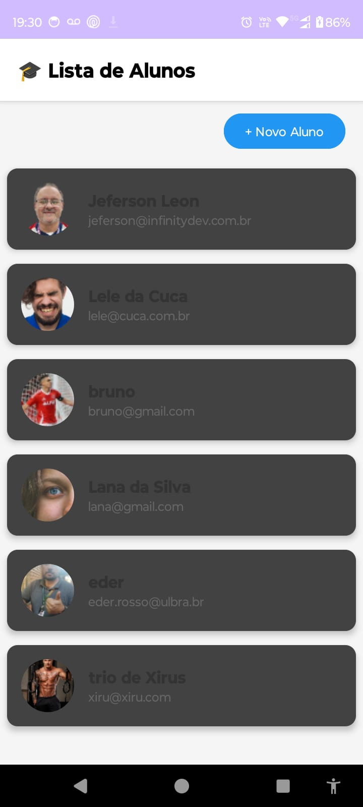
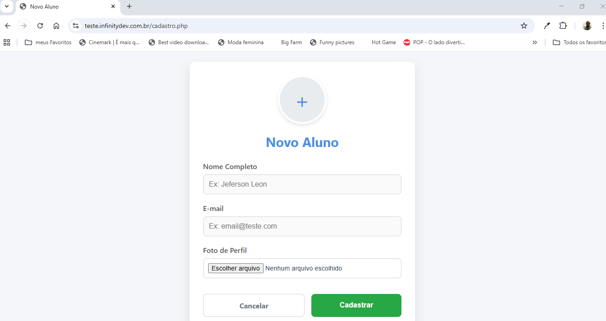
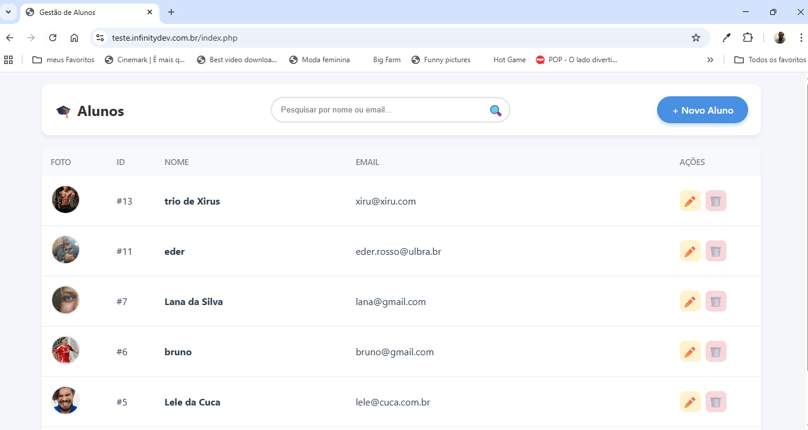
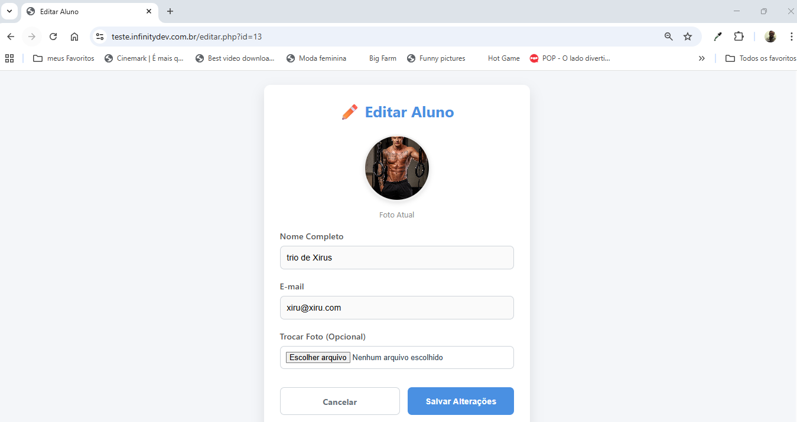

# 📱 AppAPI - Sistema de Gestão de Alunos


Este repositório contém um projeto Full-Stack educacional que integra um aplicativo **Android (Java)** com um sistema **Web (PHP/MySQL)**.

O objetivo é demonstrar na prática como realizar operações de **CRUD** (Criar, Ler, Atualizar e Deletar) e manipulação de **Imagens** (Câmera e Galeria) enviando dados do celular para um servidor real na nuvem.

---

## 📸 Screenshots

| Lista Android | Cadastro (Câmera) | Web Dashboard | Edição Web |
|:---:|:---:|:---:|:---:|
|  |  |  |  |

---

## 🚀 Funcionalidades

### 📱 Android (Cliente Mobile)
* **Listagem Dinâmica:** Consumo de API JSON usando **Retrofit**.
* **Imagens Remotas:** Carregamento de fotos do servidor usando **Glide**.
* **Câmera e Galeria:** Captura de fotos utilizando `FileProvider` (compatível com Android 11/12/13+).
* **Otimização:** Compressão de Bitmaps antes do envio para evitar timeout no servidor.
* **Upload:** Envio de dados via `Multipart/Form-Data`.

### 💻 Web (Painel Administrativo)
* **Dashboard Responsivo:** Design moderno que se adapta a Celulares e PCs (Cards vs Tabela).
* **Pesquisa:** Filtro em tempo real por nome ou e-mail.
* **CRUD Completo:** Formulários para cadastrar, editar e excluir alunos.
* **Upload Web:** Opção de usar a câmera do celular diretamente pelo navegador (`capture="environment"`).

---

## 🛠️ Tecnologias Utilizadas

* **Android:** Java, XML Layouts, Retrofit 2, Gson, Glide, OkHttp3.
* **Web:** PHP 7/8 (Nativo), HTML5, CSS3 (Flexbox/Grid), JavaScript (Preview de Imagem).
* **Banco de Dados:** MySQL (MariaDB).
* **Hospedagem:** Servidor Linux compartilhado (cPanel).

---

## ⚙️ Configuração do Ambiente (Passo a Passo)

Para rodar este projeto, você precisa configurar o Backend (Servidor) e o Frontend (Android Studio).

### 1. Banco de Dados (MySQL)
Crie um banco de dados e execute o seguinte script SQL:

```sql
CREATE TABLE IF NOT EXISTS alunos (
    id INT AUTO_INCREMENT PRIMARY KEY,
    nome VARCHAR(100) NOT NULL,
    email VARCHAR(100) NOT NULL,
    foto VARCHAR(255) DEFAULT NULL,
    data_cadastro DATETIME DEFAULT CURRENT_TIMESTAMP
) ENGINE=InnoDB DEFAULT CHARSET=utf8mb4;
2. Backend (PHP)
Suba os arquivos da pasta web/ para a raiz do seu servidor (ex: public_html).

Crie manualmente uma pasta chamada imagens e dê permissão de escrita (755 ou 777).

Edite o arquivo conexao.php com as credenciais do seu host:

PHP

$host = "localhost";
$user = "seu_usuario";
$pass = "sua_senha";
$db   = "seu_banco";
3. Android (Java)
Clone este repositório.

Abra no Android Studio.

Vá em CadastroActivity.java e MainActivity.java.

IMPORTANTE: Altere a variável urlBase para o endereço do seu site:

Java

String urlBase = "[https://seu-site-aqui.com.br/](https://seu-site-aqui.com.br/)"; // Não esqueça a barra no final!
Sincronize o Gradle e execute no seu celular físico (via USB).

📚 Aprendizados Chave (Para Alunos)
Este projeto resolve vários problemas complexos do desenvolvimento moderno:

FileProvider no Android:

Desde o Android 10, não podemos acessar arquivos diretamente. Usamos um xml/provider_paths para criar uma "ponte" segura entre a Câmera e nosso App.

Compressão de Imagem:

Fotos de câmeras modernas têm 5MB+. Servidores comuns rejeitam uploads grandes. No arquivo CadastroActivity.java, implementamos uma rotina que redimensiona e comprime a foto para ~150kb antes de enviar.

Retrofit & Multipart:

Aprendemos a enviar texto (RequestBody) e arquivos (MultipartBody.Part) na mesma requisição HTTP.

Design Responsivo Web:

O index.php usa CSS avançado (data-label e @media queries) para transformar uma Tabela HTML em "Cards" quando acessado pelo celular.

📂 Estrutura de Pastas
AppApi/
├── app/ (Código Android)
│   ├── src/main/java/br/ulbra/appapi/
│   │   ├── MainActivity.java (Lista)
│   │   ├── CadastroActivity.java (Câmera/Upload)
│   │   ├── ApiService.java (Rotas Retrofit)
│   │   └── AlunoAdapter.java (RecyclerView)
│   └── res/xml/provider_paths.xml (Config Câmera)
│
└── web/ (Código PHP)
    ├── api/
    │   ├── get_alunos.php (JSON)
    │   └── insert_aluno.php (JSON)
    ├── imagens/ (Pasta de Uploads)
    ├── conexao.php
    ├── index.php (Dashboard)
    ├── cadastro.php
    └── editar.php
📝 Licença
Desenvolvido para fins educacionais na disciplina de Desenvolvimento Mobile. Professor: Jeferson Leon


### Dicas para publicar:

1.  **Crie o arquivo:** No seu computador, crie um arquivo de texto, cole o código acima e salve como `README.md`.
2.  **Imagens:** No código acima, onde diz `via.placeholder.com`, o ideal seria você tirar *prints* reais do seu app funcionando e do site, subir na própria pasta do GitHub (ex: criar uma pasta `screenshots`) e trocar os links. Isso valoriza muito o portfólio!
3.  **Upload:** Faça o commit e push desse arquivo para o seu repositório `jefersonleon/AppApi`.

Ficou bem didático para os seus alunos entenderem a complexidade do que você construiu! Parabéns pelo projeto. 🚀
